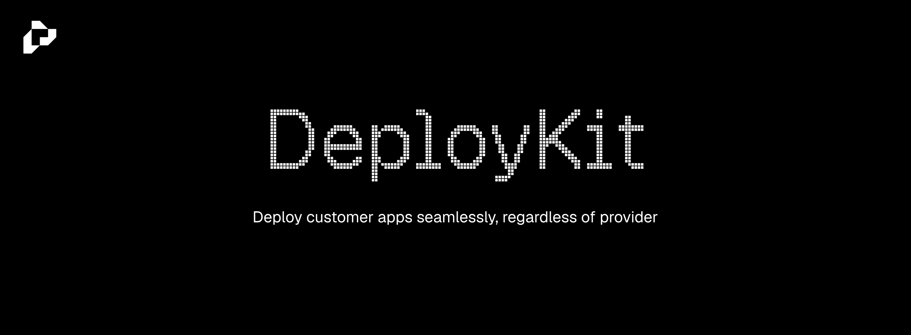

Deploy customer apps to Vercel and Cloudflare Pages from your own backend.
Built with Effect, with Promise clients for applications using `async`/`await`.
You prepare the files; deploykit handles transfer and provider operations.

## Get started

```sh
npm install @deploykit/node@alpha
```

Deploy a prepared Vercel Build Output tree:

```ts
import { createClient } from "@deploykit/node/vercel"

const client = createClient({ token: process.env.VERCEL_TOKEN! })
try {
  const deployment = await client.deployDirectory(process.env.VERCEL_PROJECT_ID!, "./site", {
    target: "production",
    activation: "deferred"
  })
  console.log(deployment.id, deployment.url)
} finally {
  await client.close()
}
```

`site/` contains `.vercel/output/`. This creates a deployment without activating production.
Follow the quickstart for saving its receipt, checking readiness and activating it.

## Documentation

- [Vercel quickstart](docs/content/docs/guides/vercel.mdx)
- [Cloudflare Pages quickstart](docs/content/docs/guides/pages.mdx)
- [Effect integration](docs/content/docs/guides/effect.mdx)
- [Full API reference](docs/content/docs/reference/index.mdx)
- [All guides](docs/content/docs/index.mdx)

**Alpha:** APIs may change. Node 22.19+ or Bun; Effect integrations use `4.0.0-rc.112`.
See the [changelog](CHANGELOG.md) for release notes.

## License

SDK packages: [MIT](LICENSE). Documentation assets have [separate notices](docs/THIRD_PARTY_NOTICES.md).
